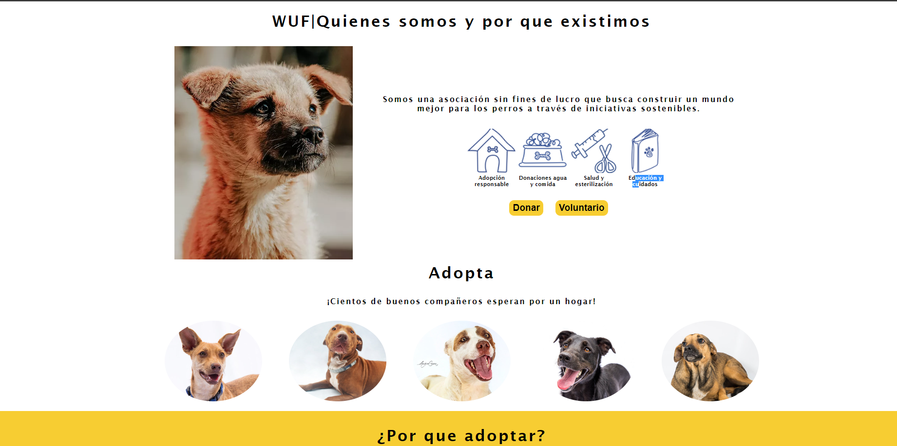

# [🐶**Club WUF**🐶](https://josuecoder.github.io/club-wuf/) |  |  

*
Pagina Web diseñada para incentivar la adopcion de perritos,
en el podras encontrar una gran variedad de  fieles amigos que 
estan esperando con ansias su nuevo hogar y brindarte todo el cariño
y el amor sincero.
*

## 🧑‍💻Instalacion:
- Ubicarse en la carpeta que contendra el proyecto.
- Abrir la terminal de comandos.
  - git clone https://github.com/josueCoder/Calculadora-tecsup.git
  - cd club-wuf.
  - Levantar la web en un servidor y disfrutar.

## 🧑‍💻Tecnologias Empleadas:

| HTML | CSS |
|------|-----|
|    |     |

## [👉**Demo**](https://josuecoder.github.io/club-wuf/) 

## Redes Sociales:
🤖 Git Hub: https://github.com/josueCoder

🤖 Linkedin:https://www.linkedin.com/in/joasul-dev/